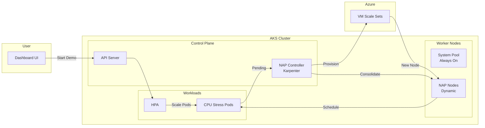
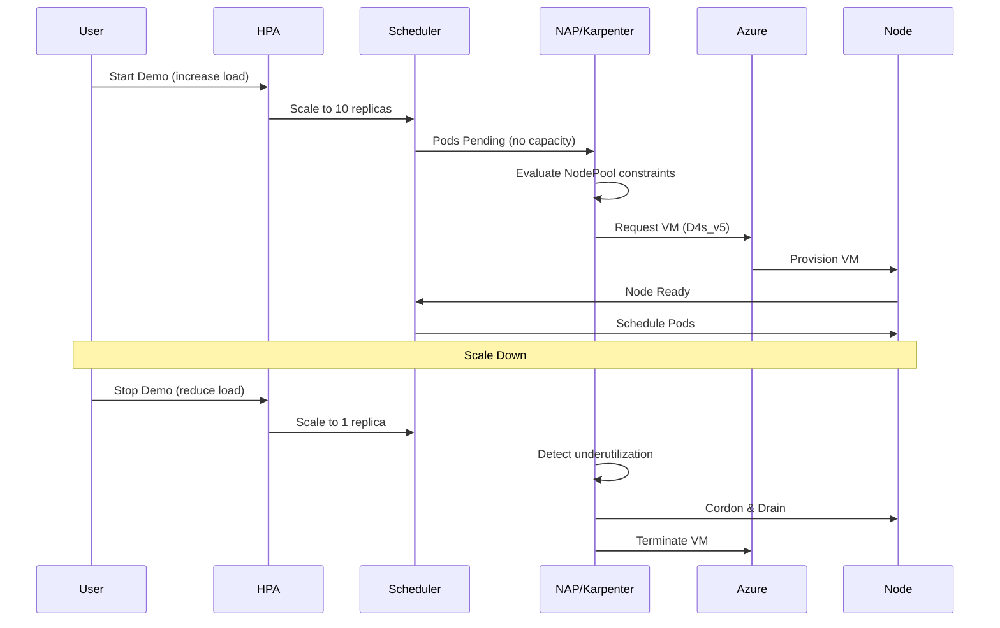

# AKS Node Auto-Provisioning (NAP) Demo

A comprehensive demonstration of Azure Kubernetes Service (AKS) Node Auto-Provisioning, showcasing how NAP (powered by Karpenter) automatically provisions and deprovisions nodes based on workload demands.


## What This Demo Shows

- **Scale-Out**: Watch NAP automatically provision new nodes when pods cant be scheduled
- **Smart VM Selection**: See NAP choose optimal VM sizes from D and E series
- **Consolidation**: Experience NAP consolidating underutilized nodes automatically
- **Real-Time Dashboard**: Monitor all NAP decisions and cluster state in a live UI

## Architecture



## How NAP Works



## Cost Warning

> **This demo provisions Azure resources that incur costs.** Always run `azd down` when finished to avoid unexpected charges.

## Prerequisites

| Tool | Version | Installation |
|------|---------|--------------|
| Azure CLI | v2.50+ | [Install](https://docs.microsoft.com/cli/azure/install-azure-cli) |
| Azure Developer CLI | v1.5+ | [Install](https://learn.microsoft.com/azure/developer/azure-developer-cli/install-azd) |
| kubectl | v1.28+ | [Install](https://kubernetes.io/docs/tasks/tools/) |
| kubelogin | latest | [Install](https://github.com/Azure/kubelogin) |
| Docker | optional | [Install](https://docs.docker.com/get-docker/) - for local builds |

**Azure Permissions Required:**
- Create AKS clusters, ACR, Managed Identities, Log Analytics

## Quick Start

### 1. Clone the Repository

```bash
git clone https://github.com/erezvol/aks-nap-demo.git
cd aks-nap-demo
```

### 2. Login to Azure

```bash
azd auth login
az login
```

### 3. Deploy the Demo

```bash
azd up
```

Deployment takes approximately 10-15 minutes. You will be prompted for environment name and Azure location.

### 4. Access the Dashboard

The deployment script outputs the dashboard URL. Open it in your browser.

### 5. Run the Demo

1. Click **Start Demo** to begin scaling simulation
2. Watch NAP provision nodes as pods scale from 1 to 10
3. Observe consolidation as workload scales down
4. Click **Stop Demo** to halt at any time

## Building Container Images

### Option 1: ACR Tasks (Cloud Build - No Docker Required)

This is the default method used by `azd up`:

```bash
# Get your ACR name
ACR_NAME=$(az acr list -g <resource-group> --query "[0].name" -o tsv)

# Build in the cloud
az acr build --registry $ACR_NAME --image nap-demo/dashboard:latest ./src/dashboard
az acr build --registry $ACR_NAME --image nap-demo/workload:latest ./src/workload
```

### Option 2: Local Docker Build

```bash
# Get ACR login server
ACR_LOGIN_SERVER=$(az acr show -n $ACR_NAME --query loginServer -o tsv)

# Login to ACR
az acr login --name $ACR_NAME

# Build locally
docker build -t $ACR_LOGIN_SERVER/nap-demo/dashboard:latest ./src/dashboard
docker build -t $ACR_LOGIN_SERVER/nap-demo/workload:latest ./src/workload

# Push to ACR
docker push $ACR_LOGIN_SERVER/nap-demo/dashboard:latest
docker push $ACR_LOGIN_SERVER/nap-demo/workload:latest
```

## Project Structure

```
aks-nap-demo/
 azure.yaml              # azd configuration
 infra/                  # Bicep IaC
    main.bicep
    modules/
 src/
    dashboard/          # Go real-time dashboard
    workload/           # Python CPU stress app
 k8s/
    nodepool.yaml       # Karpenter NodePool CRD
    dashboard/          # Dashboard K8s manifests
    workload/           # Workload + HPA manifests
 hooks/                  # azd lifecycle scripts
     postprovision.ps1   # Windows
     postprovision.sh    # Linux/Mac
```

## Configuration

### NAP NodePool Settings

Configured in `k8s/nodepool.yaml`:

| Setting | Value | Description |
|---------|-------|-------------|
| VM Families | D, E series | General purpose and memory-optimized |
| Capacity Type | On-demand | Enables consolidation (Spot-to-Spot disabled in AKS) |
| Consolidation | Immediate (0s) | Fast scale-in for demo visibility |
| CPU Limit | 100 cores | Maximum cluster size |

### HPA Settings

Configured in `k8s/workload/hpa.yaml`:

| Setting | Value |
|---------|-------|
| Min/Max Replicas | 1 / 10 |
| Target CPU | 50% utilization |

## Dashboard Features

- **Cluster Info**: AKS configuration, CNI, Kubernetes version, NodePool settings
- **Node Graph**: Real-time node count with VM SKU labels
- **Pod Placement**: Visual representation of pods on each node
- **Events Timeline**: Scrolling feed of NAP decisions with explanations
- **Demo Controls**: Start/Stop buttons for scaling simulation

## Cleanup

```bash
azd down
```

This removes all Azure resources and cleans up the local azd environment.

## Troubleshooting

### Pods stuck in Pending

```bash
kubectl get events -n nap-demo --field-selector reason=FailedScheduling
kubectl get nodeclaims
```

### NAP not provisioning nodes

```bash
kubectl get nodepools
kubectl describe nodepool nap-demo-pool
```

### Dashboard not loading

```bash
kubectl get pods -n nap-demo -l app=dashboard
kubectl logs -n nap-demo -l app=dashboard
```

## Learn More

- [AKS Node Auto-Provisioning](https://learn.microsoft.com/azure/aks/node-autoprovision)
- [Karpenter on AKS](https://learn.microsoft.com/azure/aks/karpenter)
- [Azure Developer CLI](https://learn.microsoft.com/azure/developer/azure-developer-cli/)

## License

MIT License - See [LICENSE](LICENSE)

## Contributing

See [CONTRIBUTING.md](CONTRIBUTING.md)
